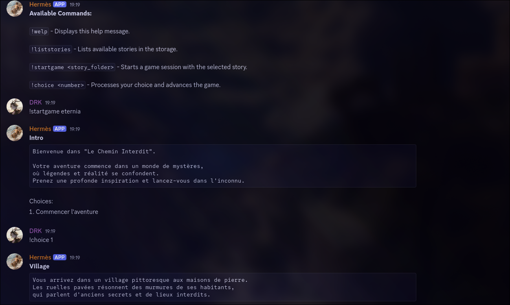

# 🕹️ Zork Game Discord Bot

Welcome to the **Zork Game Discord Bot** project!
This is a modern Python remake of a Zork-style text adventure engine ✨
tightly integrated into Discord. Write your own interactive stories in YAML, and let users play them directly via commands in your server!

---

## 📄 Overview

The bot allows users to enjoy a narrative-driven experience with:

- **🔗 Interactive choices** with story progression
- **🖋️ YAML story definitions** for easy writing
- **🪤 Text script files** for immersive storytelling
- **📢 Discord command integration** with rich output formatting

---

## 📁 Project Structure

```
zork_game/
├── ZorkAPI/               # Backend engine and YAML parsing
│   ├── managers/          # Game runner and story manager
│   ├── models/            # Game data models
│   └── utils/             # YAML parser and helpers
├── front_discord/         # Discord command system
│   ├── bot.py             # Bot launcher
│   ├── config.py          # Bot config
│   ├── src/zork.py        # Zork commands: start, choice
│   └── utils/utilities.py # Help command and extras
├── storage/               # Story and script assets
│   ├── scripts/           # Story scripts (text)
│   └── stories/           # YAML story folders
└── README_src/
    └── screen.png         # Screenshot of the bot in action
```

---

## ⚙️ Requirements

- Python 3.8+
- `discord.py`
- `PyYAML`

Install with:
```bash
pip install discord.py pyyaml
```

---

## 🔧 Setup

### 1. 🔐 Configure the Bot
Edit `front_discord/config.py`:
```python
BOT_TOKEN = "YOUR_BOT_TOKEN_HERE"
COMMAND_PREFIX = "!"
```

### 2. 🗋 Create Your Own Story
Inside `storage/stories/<your_story>/story.yaml`:
```yaml
title: A Long Static Story
scripts-path: ../../scripts/little_quest
story:
  - name: forest
    script: forest.txt
    choices:
      - text: Enter the house
        target: house
      - text: Enter the castle
        target: castle
      - text: Eat a fruit
        target: forest
  - name: house
    script: house.txt
    choices: []
  - name: castle
    script: castle.txt
    choices:
      - text: Flee
        target: forest
      - text: Kill the dragon
        target: tower
  - name: tower
    script: tower.txt
    choices: []
```

Then add your script files (e.g., `forest.txt`, `castle.txt`, etc.) inside `storage/scripts/little_quest/`.

### 3. 🔄 Run the Bot
From the root of the project:
```bash
python3 -m front_discord.bot
```
The bot should log in and print:
```
Bot is online and ready!
```

---

## 🚀 Commands

| Command              | Description |
|----------------------|-------------|
| `!welp`              | 🌐 Shows the custom help message. |
| `!liststories`       | 🔹 Lists all available story folders. |
| `!startgame <story>` | 📖 Starts a new game with the selected story. |
| `!choice <number>`   | 🔢 Make a choice by number to continue the story. |

All outputs are pretty printed using **Markdown** formatting with clean node titles, code blocks for story text, and numbered lists for choices.

---

## 📅 Example Session

```
User: !startgame long_static
Bot:
**Forest**
```
You find yourself in a vast, lush forest.
In the distance, you spot a prince perched atop a tower of a castle.
He appears to be in desperate need of assistance.
To your right lies a house.
```
Choices:
1. Enter the house
2. Enter the castle
3. Eat a fruit

User: !choice 2
Bot:
**Castle**
```
You enter the castle.
A large dragon blocks your path, preventing you from proceeding further.
A sword is on your left.
```
Choices:
1. Flee
2. Kill the dragon
```

---

## 📷 Screenshot



---

## 🎉 Build Your Own Adventure!

Creating stories is easy:
- Write your `.yaml` story file using the format shown above.
- Place your `.txt` narrative files in the `scripts/` path you define.
- Add your folder inside `storage/stories/`.
- Then just run `!startgame <your_story>` in Discord.

Unleash your creativity 📚🧩🧹 and build branching stories with as many choices and paths as you'd like!

---

## 🚀 Final Words

This project merges storytelling with real-time community interaction.
A great fit for DMs, writers, game masters, or just anyone who loves a good adventure 🚀.

Feel free to fork, extend, or integrate into your own bot ecosystem.

**Happy Zorking!** ✨

